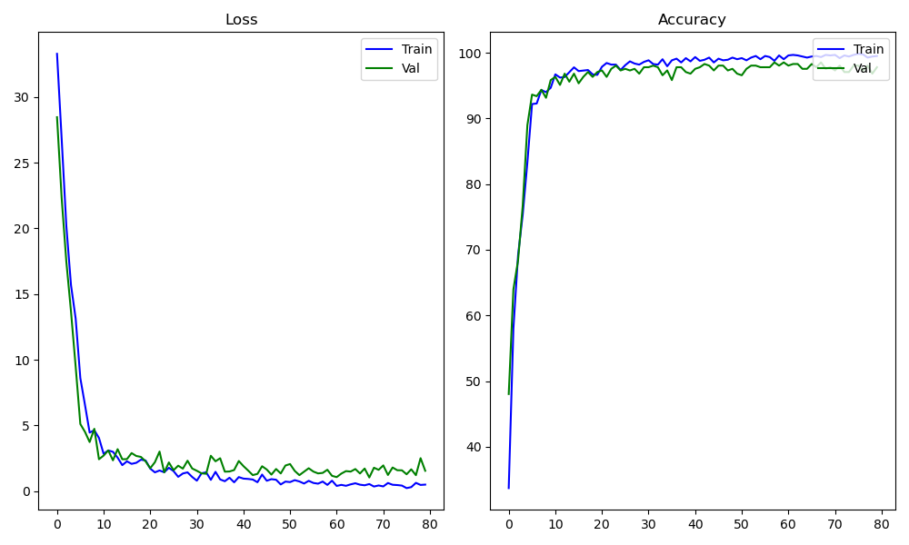
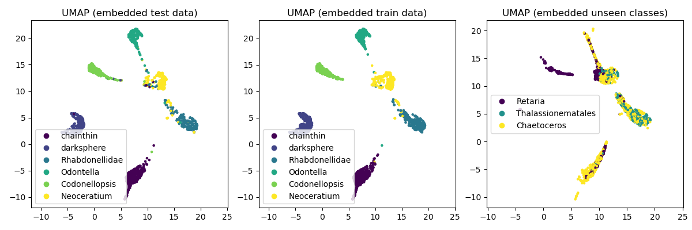

# INF368A Exercise 2
**Odin Hoff Gardå**

## Task 1 (Contrastive)

### Triplet Loss
I choose to implement a triplet loss architecture with online triplet mining. The loss function is defined as $\mathcal{L}(x_a, x_p, x_n) = \operatorname{ReLU}(\Vert f(x_a) - f(x_p) \Vert^2 - \Vert f(x_a) - f(x_n) \Vert^2 + m)$ where $m$ is a margin parameter and $(x_a, x_p, x_n)$ is a valid triplet. That is, $C(x_a) = C(x_p) \neq C(x_n)$ and $x_a \neq x_p$ where $C(x)$ denotes the class of $x$.

**Note:** The embeddings are l2-normalized in the backbone before they are passed to the triplet loss.

### Mining strategy
I implemented an online triplet mining strategy. That is, we extract the embeddings for each sample in the mini-batch, compute the euclidean distance in the embedding space and pick the most useful triplets based on our mining policy. The reason for not doing all triplets (batch-all) or random triplets is to prevent adding triplets with zero loss as these are too easy to learn from. There are two different policies for positives and negatives implemented, respectively. These are:

**Easy positive:** Given an anchor $x_a$, we choose the positive $x_p$ minimizing $\Vert f(x_a) - f(x_p)\Vert^2$.

**Hard positive:** Given an anchor $x_a$, we choose the positive $x_p$ maximizing $\Vert f(x_a) - f(x_p)\Vert^2$.

**Semi-hard negative:** We pick a negative $x_n$ satisfying $\Vert f(x_a) - f(x_p) \Vert^2 < \Vert f(x_a) - f(x_n) \Vert^2 < \Vert f(x_a) - f(x_p) \Vert^2 + m$.

**Hard negative:** We pick a negative $x_n$ satisfying $\Vert f(x_a) - f(x_p) \Vert^2 > \Vert f(x_a) - f(x_n)$. 

If we do not find any negatives satisfying the active policy, the one minimizing $\Vert f(x_a) - f(x_n)\Vert^2$ is choosen to prevent NaNs.

Without these mining policies, the model collapsed. That is, it was satisfied with learning $f(x)=0$ as the loss converged to the value of $m$. To prevent collapse, we train the model for 35 epochs using different combinations of the above policies:

1. Epoch 0 to 9: Easy positives and semi-hard negatives.
2. Epoch 10 to 24: Easy positives and hard negatives.
3. Epoch 25 to 34: Hard positives and hard negatives.

**Note:** For validation loss, we *always* use hard positives and hard negatives.

The use of easy positives in training was inspired by the paper [Improved Embeddings with Easy Positive Triplet Mining](https://arxiv.org/abs/1904.04370).

### Training
It takes around 12 minutes to train the model for 35 epochs (when Birget is having a good day) using the above strategy. We used a batch size of 128 and a learning rate of $14\cdot10^{-4}$ with the Adam optimizer. A margin of $m=0.5$ was used for this run, but different values such as 0.3 and 0.2 also give good results.
 

We can see a steady decrease in validation loss during training. There are two jumps in the training loss which are due to the change of mining policies (increasing difficulty). These jumps are not seen in the validation loss since we always compute validation loss using the most difficult triplets.

Of course, since we are not training a classifier (the last fully connected layer is omitted), there is no obvious way to compute accuracy.

## Task 2 (Classifier-based)
I chose to implement the Angular Margin Loss from ArcFace in this task. This loss function uses (l2-normalized) activations and weights from the second to last and last layer, respectively. We have two hyperparameters $s$ (scale) and $m$ (margin). These where set to $s=64$ and $m=0.5$ during training, which is the same as in [ArcFace: Additive Angular Margin Loss for Deep Face Recognition](https://arxiv.org/abs/1801.07698). I think there is room for experimentation when it comes to these parameters. See `AngularMarginLoss` in `loss_functions.py` for implementation details. 

The classifier converges pretty fast and early stops at epoch 10 after about 1-2 minutes. A batch size of 64 and learning rate of 0.0014 where used together with the Adam optimizer.

We can evaluate the ArcFace classifier by running `evaluate.py`.

**Test accuracy for each class:**

- **chainthin** 98.51% 
- **darksphere** 99.11% 
- **Rhabdonellidae** 95.54% 
- **Odontella** 97.20% 
- **Codonellopsis** 94.24% 
- **Neoceratium** 96.30% 

**Total test accuracy:** 97.06%

## Task 3 and 4
Here we compute the average angular (cosine) distances between classes in the embedding space for both models. To compute average distances, run `compute_average_distances.py`.

**Classes** | **Triplet Loss** | **Angular Margin Loss** |
:---:|:---:|:---:
Classes in training data |  |    
Unseen classes |  | 

Both models seems to achieve a good separation on average for all classes in the training data. However, as we saw earlier with the SoftMax classifier, the models are having a hard time with the last class in the unseen data.

## Task 5
Here we visualise the embeddings using UMAP for both models.

### Triplet Loss

### ArcFace 

Based on the 2-dimensional projections, both models seems to achieve good separation between the different classes in the training data. Now, for the unseen classes, the last class tends to overlap with the two other classes. Another thing to note, is that for the triplet loss, the first unseen class forms three (or more) different clusters. On the other hand, the clusters in the unseen data seems to be more connected in the ArcFace embeddings.

## Task 6
We compute the center for each class and show the 5 closest images and the 5 furthest away images with respect to the Euclidean distance to their class center. We also find the 5 closest images from other classes. The *first* and *second row* shows the closest and furthest away images within the class, respectively. The *bottom row* shows the closest images from other classes. In this task we use samples from the training data.

| **Triplet Loss** | **Angular Margin Loss** |
:---:|:---:
 | 
 | 
 | 
 | 
 | 
 | 

## Task 7
To generate accuracy plots for this task, run `transfer_learning.py`. We load the previously computed embeddings of the unseen classes and split this into training (65%) and test (35%) data. Using more and more of the training data, we fit three classifiers and evaluate them on the test data:

- Support Vector Classifier
- Linear Classifier
- kNN Classifier (with k=10)

The following plots show the test accuracy for each classifier with respect to the size of training data used.

| **Classifier** | **Triplet Loss** | **Angular Margin Loss** |
:---:|:---:|:---:
Support Vector Classifier |  | 
Linear Classifier |  | 
k-Nearest Neighbors |  |    

With the linear classifier, both models seems to perform equally well. With the SVC and kNN classifier, the Angular Margin Loss model seems to perform a little bit better when it comes to transfer learning.
