# INF368A Exercise 3
**Odin Hoff Gardå**


## Task 1 

### SimCLR 

I choose to implement SimCLR as my self-supervised model. There is mainly three components that I had to implement. Namely, the random augmentation module, the projection head and the NT-Xent based loss function. These components are described in more detail below.

### Random Augmentations 

The Random Augmentation Module (RAM) generates two random sequences of augmentations for each batch during training. The candidate augmentations are as follows:

- Random rotation (0 to 180 degrees) with white fill
- Random crop followed by resize to original size
- Color jitter
- Gaussian blur with random kernel size

The following examples shows some original images $x$, $t_1(x)$ and $t_2(x)$ where $t_1$ and $t_2$ are randomly generated agumentations:


See `utilities.py` for implementation details.

### Projection Head

The projection head consists of three fully connected layers with ReLU activation functions in-between:

```
nn.Linear(self.embedding_dimension, self.hidden_dimension),
nn.ReLU(),
nn.Linear(self.hidden_dimension, self.hidden_dimension),
nn.ReLU(),
nn.Linear(self.hidden_dimension, self.output_dimension)
```

All dimensions where set to $d=128$ in our case. The implementation of the projection head can be found in `backbone.py`.

### Loss Function

The loss function is based on the NT-Xent loss (Normalized Temperature-scaled Cross Entropy Loss) from the original paper [A Simple Framework for Contrastive Learning of Visual Representations
](https://arxiv.org/abs/2002.05709).

See `loss_functions.py` for implementation details. During training we use $\tau=0.1$ for the temperature. There is possibly room for experementation when it comes to $\tau$.

### Training
The following plot shows training and validation loss:

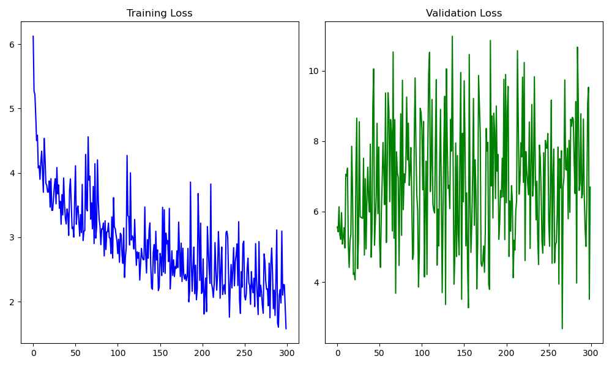

**Comment:** During training, we are clearly minmizing the NT-Xent loss. But, I am not sure what is happening with the validation loss here. Maybe it does not make sense to use the same loss for images the model has never seen before? The important metric is anyways how well we perform at downstream tasks, i.e., the transfer learning part for unseen classes.

## Task 2 

### Average Angular Distances
For the classes the model has trained on, we see some separation in terms of average angular distances. It seems a bit confused about the classes `Rhabdonellidae`, `Odontella` and `Neoceratium`. But overall, when taking into account that this is unsupervised learning, I am pretty happy with these results.

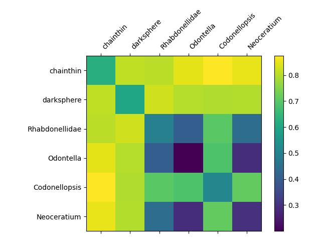

For the unseen classes, the average distances looks even better than all previous methods (SoftMax, triplet loss and ArcFace). This may indicate that we have actually learned some important features without overfitting on our training data.
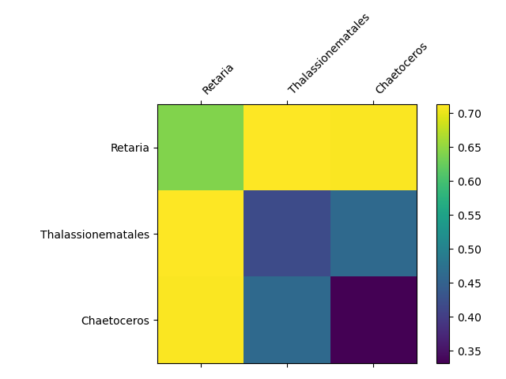

## Task 3

Where did task 3 go anyways?

## Task 4
Here we visualize a 2-dimensional projection of the embeddings using UMAP. The separation is not very clear, but there seems to be some clustering going on. It might be that the separation is better in the embedding space (where we have $128$ dimensions).

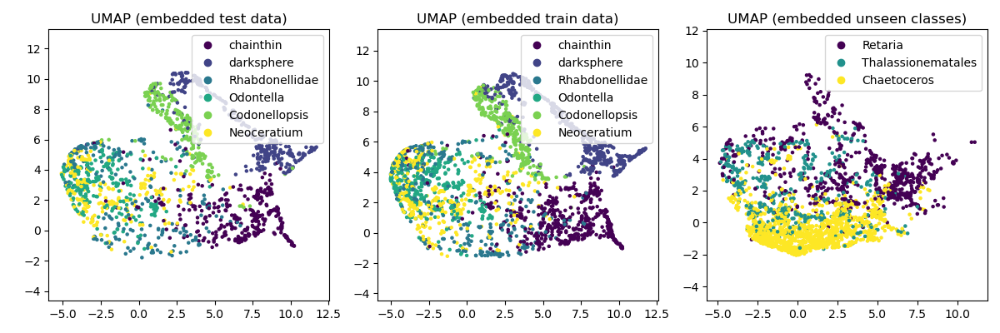

## Task 5
For each of the six classes appearing in our training data, we display 
 
- The five images in the same class closest to the class center,
- The five images in the same class furthest away from the class center, and
- The five images from other classes closest to the class center.

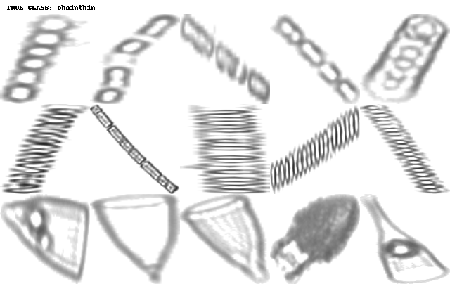
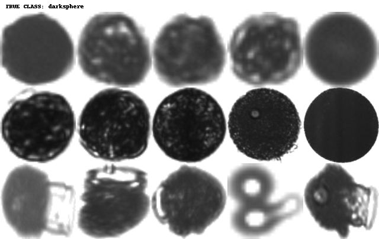
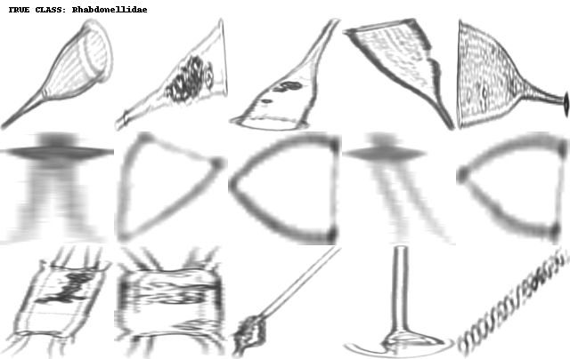

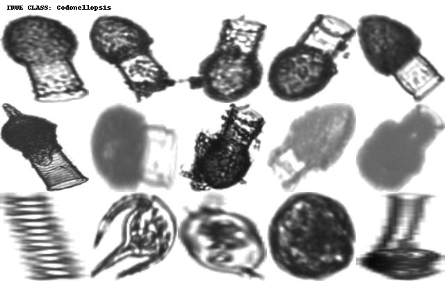
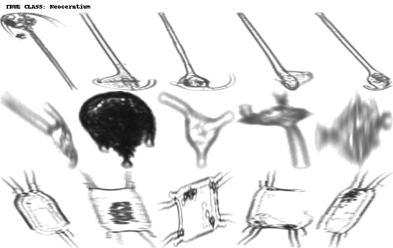


## Task 6
As in previous exercises, we now train simple classifiers (Linear, SVC and kNN) on unseen classes using the embeddings learned by our SimCLR implementation. We plot the test accuracy for different amounts of training data (known labels).

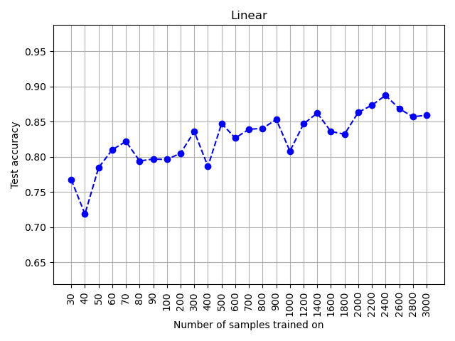
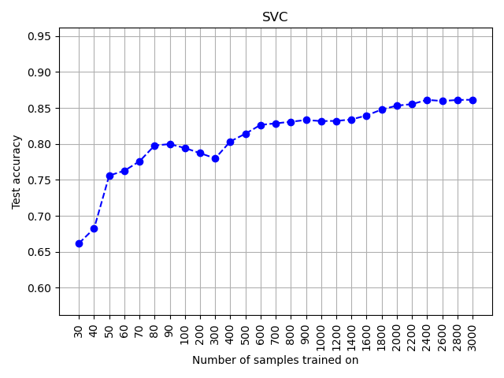
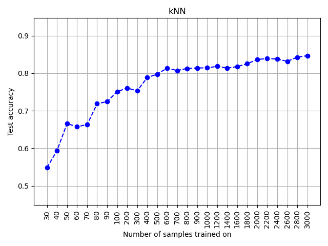

These results are the best so far! For example, using a Support Vector Classifier, we achieve around 80% accuracy training only on 90 our of 3000 images. This can potentially save a lot of manual labour. The linear classifier and SVC seems to perform slightly better than the kNN classifier. But this might even out if we spend some effort on tuning hyper-parameters. In practice, I think all three should be considered as worthy candidates. If we have very few labels, then I think we should go for the linear classifier or the SVC based on these results.

## Task 7

Some things I have observed:

- A standard SoftMax classifier can give useful embeddings (on this small dataset at least).
- Triplet loss can easily collapse if the triplet mining is not done right.
- SimCLR works surprisingly well (on this small dataset).
- Actually, SimCLR outperformed the other models... Maybe the other models overfit on the training data, preventing it from learning *general features of plankton*™?

I will train all the models on a bigger dataset with more classes after this assignment. Maybe it will be easier to spot differences between performances in that case. With the current dataset, SimCLR performed best. And a batch size of 256 was sufficient, so it was not too memory expensive. SimCLR is the only self-supervised method of the ones I have implemented. So if labelling is expensive, self-supervised is the way to go. If labels are cheap, I would expect some of the semi-supervised or supervised methods to do better in general.
